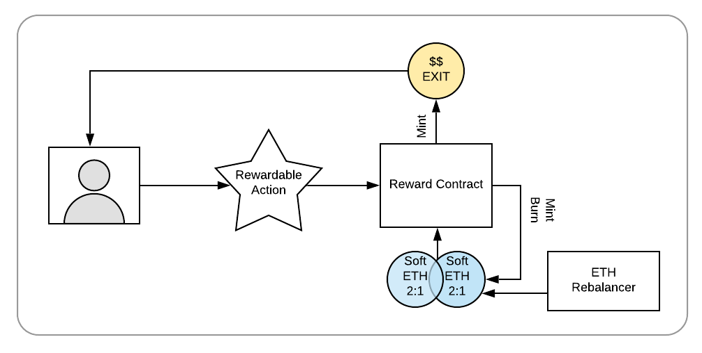

# EXIT: Synthetically Derived, Stable Value Reward Token

The EXIT token is a stable synthetic ****currency whose face value and purchasing power is equivalent to the US Dollar \(1 EXIT token =~ $1 US Dollar\). It is minted in response to a rewardable action. This can take different forms, for example as a staking reward, a reward for completing a task, collecting a number of items, or other configurable tasks.

In order to mint EXIT, the protocol is over-collateralized with a 2nd token pegged to ETH called softETH. The softETH value is regulated by calls to a PriceOracle contract to maintain the corresponding ETH value \(1 softETH = 1 ETH\). 

Soft ETH is preserved in the contract at a 2:1 ratio to the face value of EXIT,  and is programmatically rebalanced to maintain this 2:1 ratio relative to the amount of EXIT minted by the protocol.  If the price of ETH drops, more soft ETH is minted to match the 2:1 ratio. If the price increases, the excess soft ETH is burned to maintain the same ratio.

Soft ETH provides a point-of-reference overcollateralization mechanism for EXIT. Unlike ETH, soft ETH can be minted and burned. However, it cannot be removed from the contract. It remains within the contract to reflect and support the EXIT token value. 

## **Reward Economy**

When a participant engages in a rewardable activity, they spend time and/or resources and receive an incentive in return \(EXIT tokens\). Activities are limited by the time available to a participant, or the resources they are willing to provide in exchange for the reward. In this way, the reward supply is limited. EXIT is created in response to work or resource expenditure - it is backed by rewardable activities.

Minting EXIT requires resource expenditure. The minting and burning process incurs transaction fees, as does softETH rebalancing to ensure the virtual peg remains 1:1 with ETH. Costs to produce EXIT provide an additional backing measure. ****

EXIT can only be created through this cost/reward mechanism. It requires time, resources and programmatic costs to produce EXIT, creating an intrinsic value for the token. A stable face value is maintained through the rebalancing component and soft ETH 2:1 overcollateralization.

## **EXIT Stability**

Stability hinges on two factors. 

1. **Face value of the token**: Face value is maintained in the contract at ~ $1.00 USD per EXIT. This price may vary based on the current ETH backing value; it is rebalanced every time a call is made to the PriceOracle. The soft ETH balance is adjusted at that time to maintain the virtual 2:1 peg. 
2.  **Exchange value of the token**: Exchange liquidity and supply/demand market forces determine the exchange value. If there is no liquidity for trading \(ie not enough DAI in an exchange to cover an EXIT trade\), then the value is capped by the amount of available liquidity.


For example, if an individual wants to trade 1000 EXIT for 1000 DAI on [Uniswap](https://uniswap.exchange/), but there is only 500 DAI in the exchange, the user can either trade 500 EXIT for 500 DAI, or trade any amount over 500 for the same 500 DAI, effectively reducing the value. This issue occurs now with any stable trading pair when liquidity limits are reached.


