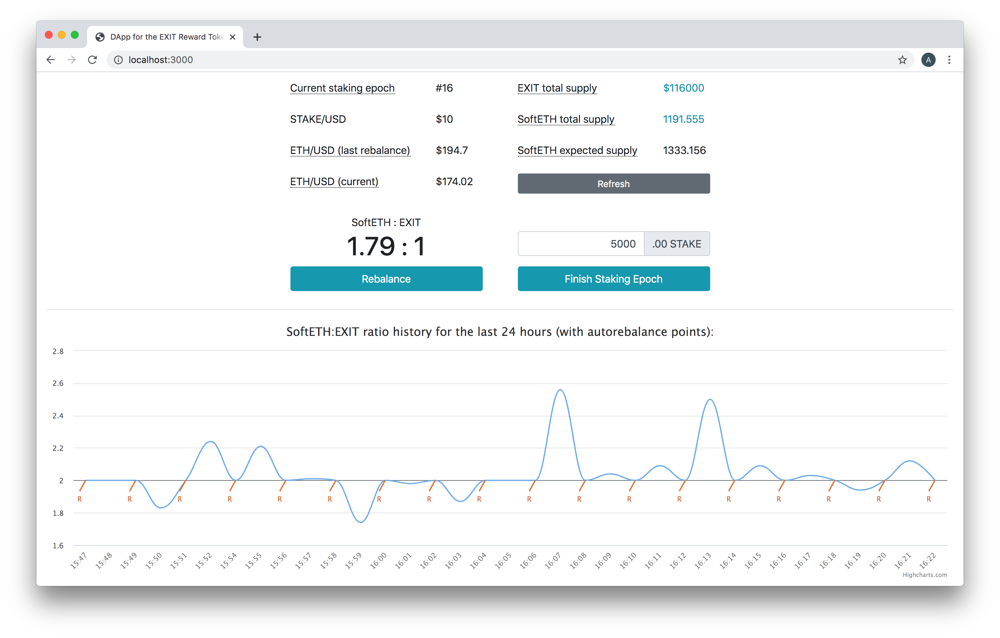
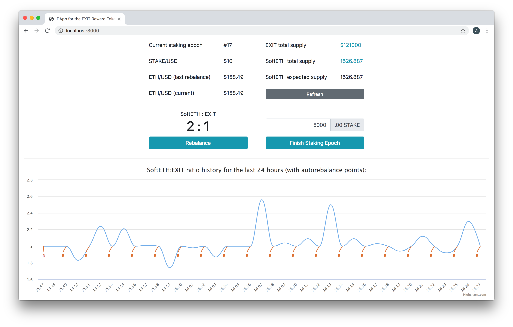

# EXIT Emulator

This simple UI running on Ethereum Mainnet demonstrates an EXIT reward token use-case. In this scenario, EXIT is minted relative to the amount of STAKE minted per staking epoch in the POSDAO staking implementation.

The rebalancing feature, set to auto-rebalance once every 24 hours \(configurable\), can also be called by anyone at any time. Rebalancing resets the 2:1 ratio of `SoftETH : EXIT`

The EXIT emulator is live on the Mainnet: [**https://exit.poa.network**](https://exit.poa.network/)\*\*\*\*

The EXIT reward prototype contracts are located at: [**https://github.com/xdaichain/exit-reward-prototype**](https://github.com/xdaichain/exit-reward-prototype)\*\*\*\*

### **Addresses on Mainnet:**

* **Reward**: [https://etherscan.io/address/0xbe13b07351fa9e22d0c37a304b6d69787fbb0f21\#code](https://etherscan.io/address/0xbe13b07351fa9e22d0c37a304b6d69787fbb0f21#code)
* **RewardProxy** \(a proxy for the upgradable Reward contract\): [https://etherscan.io/address/0xf0aC1928cf8a2e29829e78d4C8A40b8Bf5dD4329\#code](https://etherscan.io/address/0xf0aC1928cf8a2e29829e78d4C8A40b8Bf5dD4329#code)
* **ExitToken**: [https://etherscan.io/token/0x688D0d44F81F2D82c50e0acc674DA60fD3d88e3A](https://etherscan.io/token/0x688D0d44F81F2D82c50e0acc674DA60fD3d88e3A)
* **SoftETHToken**: [https://etherscan.io/token/0xDa3E4365E7Ad3f42f9C1b19d0a864d408AA9f757](https://etherscan.io/token/0xDa3E4365E7Ad3f42f9C1b19d0a864d408AA9f757)


**Notes:**

* To retrieve ETH/USD on Mainnet we are using a **PriceOracle contract** \(0xAd13fE330B0aE312bC51d2E5B9Ca2ae3973957C7\). 
* The **Finish Staking Epoch** button simulates the end of an epoch. The contract mints EXIT and rebalances the SoftETH:EXIT ratio automatically at the end of each staking epoch. EXIT and STAKE will be distributed to stakers relative to the amount of STAKE they placed in the protocol. 
* The **auto-rebalancing** time in seconds is set with `REBALANCE_INTERVAL` environment variable. ETH/USD rate update interval for the UI chart is set with the `RATIO_READ_INTERVAL` env variable \(also in seconds\). 
* The **auto-rebalancing** max gas price is set with the `REBALANCER_MAX_GAS_PRICE` environment variable \(in wei\).


## Local Installation

1\) Clone the repo and go to the app folder.

```text
git clone https://github.com/xdaichain/exit-reward-prototype && cd exit-reward-prototype/app
```

2\) Create a `key` file in the app folder containing the **private key** of the Ethereum address used to pay rebalancing fees. This account must have some ETH to pay for transactions.

```text
cat > key
your_private_key
[CTRL+C]
```

3\) Install dependencies and launch the application and rebalancer.

```text
npm i && env RATIO_READ_INTERVAL=600 REBALANCE_INTERVAL=86400 REBALANCER_MAX_GAS_PRICE=10000000000 npm run dev
```

4\) You can now interact with the application at [**http://localhost:3000**](http://localhost:3000/)**.** Auto-rebalance occurs every 24 hours. The rate chart is updated when the page reloads \(manually or when rebalancing occurs\). You can exit the application and rebalancer with `CTRL+C`




To interact with the DApp you will need to ****connect your Web3Wallet \(MetaMask\) to Mainnet and populate with some ETH. [Click for Instructions.](connect-to-metamask.md)


## Server Installation

To run the Application on a live server with Docker Compose, use the instruction [https://github.com/xdaichain/exit-reward-prototype/tree/docker-compose\#readme](https://github.com/xdaichain/exit-reward-prototype/tree/docker-compose#readme)

## Actions

**Terminology:** Hover over a term in UI for more information. [Full terminology is below](./#terminology).

**Refresh**: Refreshes the interface to include the latest `ETH/USD (current)` price and the `SoftETH expected supply`. This is a free call that does not require any gas.

**Rebalance**: Updates the amount of SoftETH in the contract to maintain a  2:1 SoftETH:EXIT backing ratio. This function mints SoftETH if the ratio is less than 2:1 \(ie 1.8:1\) or burns SoftETH if the ratio is greater than 2:1. While this is a manual process, it also runs in the background every 180 minutes \(configurable through the `REBALANCE_INTERVAL` env variable\).

To rebalance manually, press the `Rebalance` button and sign the transaction in MetaMask. The transaction will be confirmed on screen, and the ratio will return to 2:1. You will see a `Someone invoked rebalancing message` during processing.

**Finish Staking Epoch**: This button simulates the end of a staking epoch. You can adjust the amount of STAKE minted \(default is 5000\). In production, this will adjust automatically based on the amount of STAKE locked in the protocol. Once an amount of STAKE is selected, press `Finish Staking Epoch` and sign the transaction in MetaMask.

When confirmed, the Current staking epoch will increment, the EXIT and SoftETH totals will adjust accordingly, and the SoftETH:EXIT ratio will rebalance.

In this example, STAKE is set to a $10 valuation, resulting in 1 EXIT minted for every 1 STAKE minted.



## **Terminology**

**Current Staking Epoch**: Number of the current staking epoch. At the end of each staking epoch, STAKE and EXIT rewards are minted and distributed to participants \(validators and their delegators\) who participated in the epoch.

**STAKE/USD**: Set to 10 to simplify the demonstration \(this can be changed in the contract\). In this example, EXIT is minted at a 1:10 ratio with STAKE. For every $10 worth of STAKE, $1 worth of EXIT is minted. 

**ETH/USD \(last rebalance\)**_:_ The price of ETH at the previous rebalance.

**ETH/USD \(current\)**: The price of ETH in USD for current block. Retrieved on **Refresh.**

**EXIT total supply**: Total amount of minted EXIT currently in the contract.

**SoftETH total supply**: Total amount of SoftETH currently in the contract to support the EXIT price. 

**SoftETH expected supply**. The amount of SoftETH required in the contract to support the 2:1 ratio. This will either be smaller or larger than the total supply depending on the current ETH price.

