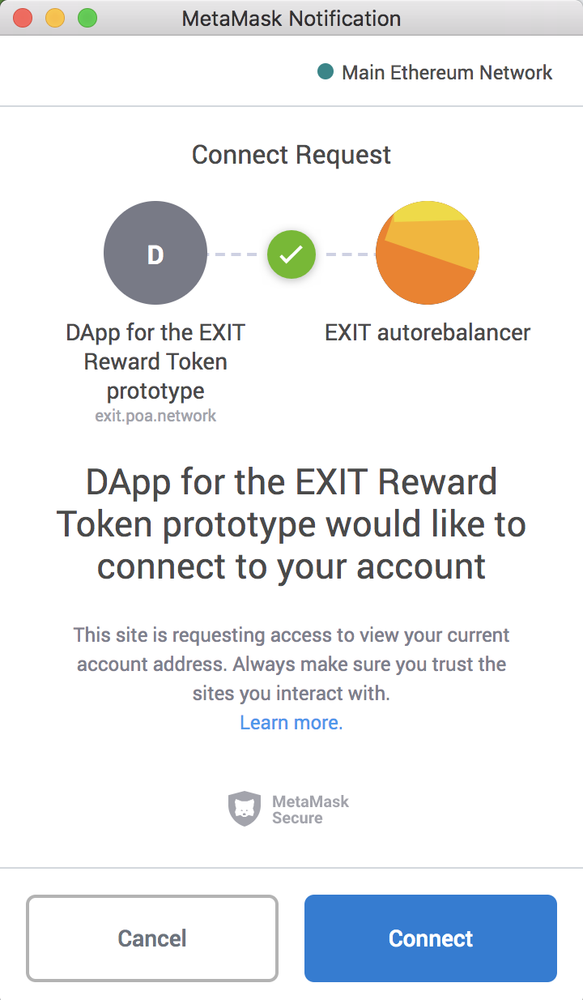

# Connect to MetaMask

## Web3Wallet \(MetaMask\) Connection

You will connect a Web3wallet to interact with the DApp.

1\) Open MetaMask and connect to the **Main Ethereum Network** from the network dropdown.

2\) Ensure you have some ETH on your wallet. You will need this to process transactions. 

3\) Your wallet will be triggered by pressing either the `Rebalance` or `Finish Staking Epoch` buttons in the DApp. Click **Connect** to confirm.

\*\*\*\*

